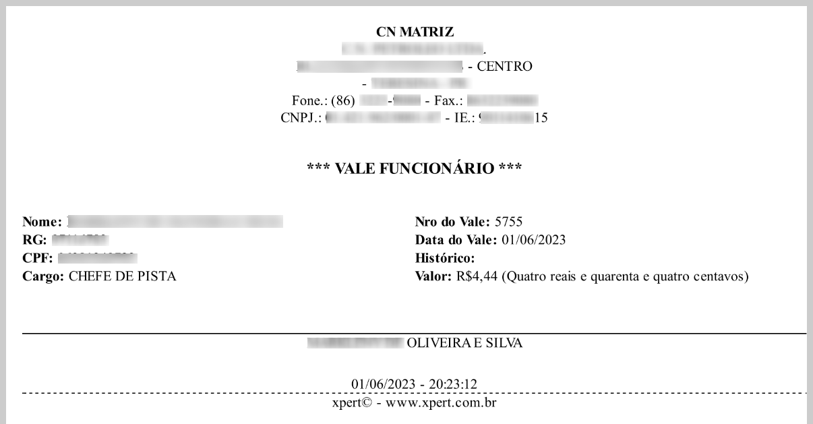
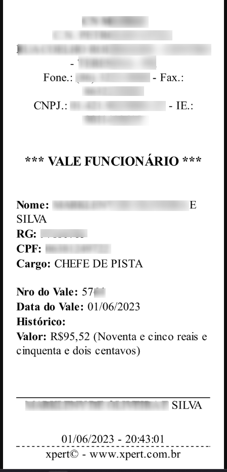

# XPertWeb PDF

## Usage

```
yarn gulp
```

## PDF Handlebars

### Example 1

```html
<html>
  <head>
    <link
      href="https://raw.githubusercontent.com/xpert-brasil/xpertweb-pdf/main/css/xpertweb.min.css"
      rel="stylesheet"
    />
    <style>
      body {
        font-size: 14px;
      }
      .my-border-signature {
        border-top: 1px solid #000;
      }
      .my-border-footer {
        border-top: 1px dashed;
      }
    </style>
  </head>
  <body>
    <div class="container p-2">
      {{! HEADER }}
      <div class="text-center">
        <p class="m-0"><b>{{nomeFilial}}</b></p>
        <p class="m-0">{{razaoSocial}}</p>
        <p class="m-0">{{ruaFilial}} - {{bairroFilial}}</p>
        <p class="m-0">{{cepFilial}} - {{cidadeFilial}} - {{estadoFilial}}</p>
        <p class="m-0">Fone.: {{foneFilial}} - Fax.: {{faxFilial}}</p>
        <p class="m-0">CNPJ.: {{cnpjFilial}} - IE.: {{ieFilial}}</p>
      </div>
      <div class="text-center pt-3">
        <h3>*** VALE FUNCIONÁRIO ***</h3>
      </div>
      {{! BODY }}
      <div class="row">
        <div class="col pt-3">
          <p class="m-0"><b>Nome: </b> {{usuario}}</p>
          <p class="m-0"><b>RG: </b> {{rg}}</p>
          <p class="m-0"><b>CPF: </b> {{cpf}}</p>
          <p class="m-0"><b>Cargo: </b> {{cargo}}</p>
        </div>
        <div class="col pt-3">
          <p class="m-0"><b>Nro do Vale: </b> {{nroVale}}</p>
          <p class="m-0"><b>Data do Vale: </b> {{dtaVale}}</p>
          <p class="m-0"><b>Histórico: </b> {{historico}}</p>
          <p class="m-0"><b>Valor: </b> {{valor}} ({{valorExtenso}})</p>
        </div>
        <div class="col-clear"></div>
      </div>
      {{! FOOTER }}
      <div class="text-center pt-5">
        <p class="m-0 my-border-signature">{{usuario}}</p>
      </div>
      <div class="text-center pt-4">
        <p class="m-0">{{data}} - {{hour}}</p>
        <p class="m-0 my-border-footer">xpert© - www.xpert.com.br</p>
      </div>
    </div>
  </body>
</html>
```



### Example 2

```html
<html>
  <head>
    <link
      href="https://raw.githubusercontent.com/xpert-brasil/xpertweb-pdf/main/css/xpertweb.min.css"
      rel="stylesheet"
    />
    <style>
      body {
        font-size: 14px;
      }
      .my-border-signature {
        border-top: 1px solid #000;
      }
      .my-border-footer {
        border-top: 1px dashed;
      }
    </style>
  </head>
  <body>
    <div class="p-2">
      {{! HEADER }}
      <div class="text-center">
        <p class="m-0"><b>{{nomeFilial}}</b></p>
        <p class="m-0">{{razaoSocial}}</p>
        <p class="m-0">{{ruaFilial}} - {{bairroFilial}}</p>
        <p class="m-0">{{cepFilial}} - {{cidadeFilial}} - {{estadoFilial}}</p>
        <p class="m-0">Fone.: {{foneFilial}} - Fax.: {{faxFilial}}</p>
        <p class="m-0">CNPJ.: {{cnpjFilial}} - IE.: {{ieFilial}}</p>
      </div>
      <div class="text-center pt-3">
        <h3>*** VALE FUNCIONÁRIO ***</h3>
      </div>
      {{! BODY }}
      <div class="pt-3">
        <p class="m-0"><b>Nome: </b> {{usuario}}</p>
        <p class="m-0"><b>RG: </b> {{rg}}</p>
        <p class="m-0"><b>CPF: </b> {{cpf}}</p>
        <p class="m-0"><b>Cargo: </b> {{cargo}}</p>
      </div>
      <div class="pt-3">
        <p class="m-0"><b>Nro do Vale: </b> {{nroVale}}</p>
        <p class="m-0"><b>Data do Vale: </b> {{dtaVale}}</p>
        <p class="m-0"><b>Histórico: </b> {{historico}}</p>
        <p class="m-0"><b>Valor: </b> {{valor}} ({{valorExtenso}})</p>
      </div>
      {{! FOOTER }}
      <div class="text-center pt-5">
        <p class="m-0 my-border-signature">{{usuario}}</p>
      </div>
      <div class="text-center pt-4">
        <p class="m-0">{{data}} - {{hour}}</p>
        <p class="m-0 my-border-footer">xpert© - www.xpert.com.br</p>
      </div>
    </div>
  </body>
</html>
```


