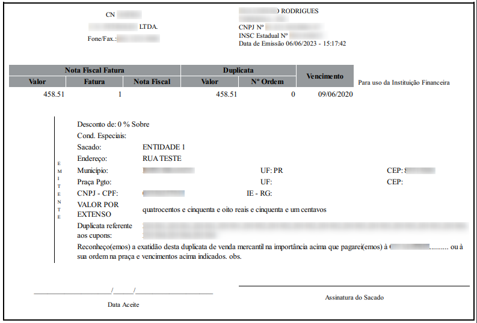

# XPertWeb PDF

## Usage

```
yarn gulp
```

## PDF Handlebars

### Example 1

```html
<html>
  <head>
    <link
      href="https://raw.githubusercontent.com/xpert-brasil/xpertweb-pdf/main/css/xpertweb.min.css"
      rel="stylesheet"
    />
    <style>
      body {
        font-size: 14px;
      }
      .my-border-signature {
        border-top: 1px solid #000;
      }
      .my-border-footer {
        border-top: 1px dashed;
      }
    </style>
  </head>
  <body>
    <div class="container p-2">
      {{! HEADER }}
      <div class="text-center">
        <p class="m-0"><b>{{nomeFilial}}</b></p>
        <p class="m-0">{{razaoSocial}}</p>
        <p class="m-0">{{ruaFilial}} - {{bairroFilial}}</p>
        <p class="m-0">{{cepFilial}} - {{cidadeFilial}} - {{estadoFilial}}</p>
        <p class="m-0">Fone.: {{foneFilial}} - Fax.: {{faxFilial}}</p>
        <p class="m-0">CNPJ.: {{cnpjFilial}} - IE.: {{ieFilial}}</p>
      </div>
      <div class="text-center pt-3">
        <h3>*** VALE FUNCIONÁRIO ***</h3>
      </div>
      {{! BODY }}
      <div class="row">
        <div class="col pt-3">
          <p class="m-0"><b>Nome: </b> {{usuario}}</p>
          <p class="m-0"><b>RG: </b> {{rg}}</p>
          <p class="m-0"><b>CPF: </b> {{cpf}}</p>
          <p class="m-0"><b>Cargo: </b> {{cargo}}</p>
        </div>
        <div class="col pt-3">
          <p class="m-0"><b>Nro do Vale: </b> {{nroVale}}</p>
          <p class="m-0"><b>Data do Vale: </b> {{dtaVale}}</p>
          <p class="m-0"><b>Histórico: </b> {{historico}}</p>
          <p class="m-0"><b>Valor: </b> {{valor}} ({{valorExtenso}})</p>
        </div>
        <div class="col-clear"></div>
      </div>
      {{! FOOTER }}
      <div class="text-center pt-5">
        <p class="m-0 my-border-signature">{{usuario}}</p>
      </div>
      <div class="text-center pt-4">
        <p class="m-0">{{data}} - {{hour}}</p>
        <p class="m-0 my-border-footer">xpert© - www.xpert.com.br</p>
      </div>
    </div>
  </body>
</html>
```


### Example 2

```html
<html>
  <head>
    <link
      href="https://raw.githubusercontent.com/xpert-brasil/xpertweb-pdf/main/css/xpertweb.min.css"
      rel="stylesheet"
    />
    <style>
      body {
        font-size: 14px;
      }
      .my-border-signature {
        border-top: 1px solid #000;
      }
      .my-border-footer {
        border-top: 1px dashed;
      }
    </style>
  </head>
  <body>
    <div class="p-2">
      {{! HEADER }}
      <div class="text-center">
        <p class="m-0"><b>{{nomeFilial}}</b></p>
        <p class="m-0">{{razaoSocial}}</p>
        <p class="m-0">{{ruaFilial}} - {{bairroFilial}}</p>
        <p class="m-0">{{cepFilial}} - {{cidadeFilial}} - {{estadoFilial}}</p>
        <p class="m-0">Fone.: {{foneFilial}} - Fax.: {{faxFilial}}</p>
        <p class="m-0">CNPJ.: {{cnpjFilial}} - IE.: {{ieFilial}}</p>
      </div>
      <div class="text-center pt-3">
        <h3>*** VALE FUNCIONÁRIO ***</h3>
      </div>
      {{! BODY }}
      <div class="pt-3">
        <p class="m-0"><b>Nome: </b> {{usuario}}</p>
        <p class="m-0"><b>RG: </b> {{rg}}</p>
        <p class="m-0"><b>CPF: </b> {{cpf}}</p>
        <p class="m-0"><b>Cargo: </b> {{cargo}}</p>
      </div>
      <div class="pt-3">
        <p class="m-0"><b>Nro do Vale: </b> {{nroVale}}</p>
        <p class="m-0"><b>Data do Vale: </b> {{dtaVale}}</p>
        <p class="m-0"><b>Histórico: </b> {{historico}}</p>
        <p class="m-0"><b>Valor: </b> {{valor}} ({{valorExtenso}})</p>
      </div>
      {{! FOOTER }}
      <div class="text-center pt-5">
        <p class="m-0 my-border-signature">{{usuario}}</p>
      </div>
      <div class="text-center pt-4">
        <p class="m-0">{{data}} - {{hour}}</p>
        <p class="m-0 my-border-footer">xpert© - www.xpert.com.br</p>
      </div>
    </div>
  </body>
</html>
```


### Example 3

```html
<html>
  <link
    href="https://raw.githubusercontent.com/xpert-brasil/xpertweb-pdf/main/css/xpertweb.min.css"
    rel="stylesheet"
  />
  <style>
    body {
      font-size: 14px;
    }
    #tb-emitente {
      font-size: 10px;
    }
  </style>

  <body>
    {{! HEADER }}
    <div class="container border-2 p-2">
      <div class="row">
        <div class="col text-center">
          <p class="m-2">{{nomeFilial}}</p>
          <p class="m-2">{{razaoSocial}}</p>
          <p class="m-2">Fone/Fax.:{{foneFilial}}</p>
        </div>
        <div class="col text-left">
          <p class="m-0">{{enderecoFilial}}</p>
          <p class="m-0">{{cidadeFilial}} - {{estadoFilial}} - {{cepFilial}}</p>
          <p class="m-0">CNPJ Nº {{cnpjFilial}}</p>
          <p class="m-0">INSC Estadual Nº {{ieFilial}}</p>
          <p class="m-0">Data de Emissão {{dataEmissao}}</p>
        </div>
        <div class="col-clear"></div>
      </div>
      <br />
      <br />
      {{! BODY }}
      <div class="row">
        <div class="col-75">
          <table class="table">
            <thead class="bg-gray">
              <tr>
                <th colspan="3">Nota Fiscal Fatura</th>
                <th colspan="2">Duplicata</th>
                <th rowspan="2">Vencimento</th>
              </tr>
              <tr>
                <th>Valor</th>
                <th>Fatura</th>
                <th>Nota Fiscal</th>
                <th>Valor</th>
                <th>Nº Ordem</th>
              </tr>
            </thead>
            <tbody>
              <tr>
                <td class="text-end">{{valorNotaFiscal}}</td>
                <td class="text-end">{{nroFatura}}</td>
                <td class="text-end">{{nroNotaFiscal}}</td>
                <td class="text-end">{{valorDuplicata}}</td>
                <td class="text-end">{{nrOrdem}}</td>
                <td class="text-end">{{dataVencimento}}</td>
              </tr>
            </tbody>
          </table>
        </div>
        <div class="col-25 pt-3">
          <p class="px-2">Para uso da Instituição Financeira</p>
        </div>
        <div class="col-clear"></div>
      </div>
      <br />
      <br />
      {{! Dados do Cliente }}
      <div class="row">
        <div class="col-10">
          <p>&nbsp;</p>
        </div>
        <div class="col-90">
          <table class="table border-s">
            <tbody>
              <tr>
                <td rowspan="11" width="5%">
                  <table id="tb-emitente">
                    <tbody>
                      <tr>
                        <td>E</td>
                      </tr>
                      <tr>
                        <td>M</td>
                      </tr>
                      <tr>
                        <td>I</td>
                      </tr>
                      <tr>
                        <td>T</td>
                      </tr>
                      <tr>
                        <td>E</td>
                      </tr>
                      <tr>
                        <td>N</td>
                      </tr>
                      <tr>
                        <td>T</td>
                      </tr>
                      <tr>
                        <td>E</td>
                      </tr>
                    </tbody>
                  </table>
                </td>
              </tr>
              <tr>
                <td colspan="6">Desconto de: {{desconto}} % Sobre</td>
              </tr>
              <tr>
                <td>Cond. Especiais:</td>
                <td colspan="5">&nbsp;</td>
              </tr>
              <tr>
                <td>Sacado:</td>
                <td colspan="5">{{nomeEntidade}}</td>
              </tr>
              <tr>
                <td>Endereço:</td>
                <td colspan="5">{{enderecoEntidade}}</td>
              </tr>
              <tr>
                <td>Município:</td>
                <td>{{cidadeEntidade}}</td>
                <td class="text-end">UF:</td>
                <td>{{estadoEntidade}}</td>
                <td class="text-end">CEP:</td>
                <td>{{cepEntidade}}</td>
              </tr>
              <tr>
                <td>Praça Pgto:</td>
                <td>{{pracaPgto}}</td>
                <td class="text-end">UF:</td>
                <td>{{ufPraca}}</td>
                <td class="text-end">CEP:</td>
                <td>{{cepPraca}}</td>
              </tr>
              <tr>
                <td>CNPJ - CPF:</td>
                <td>{{cnpjCpfEntidade}}</td>
                <td class="text-end">IE - RG:</td>
                <td>{{ieEntidade}}</td>
              </tr>
              <tr>
                <td>VALOR POR EXTENSO</td>
                <td colspan="5">{{vlrExtenso}}</td>
              </tr>
              <tr>
                <td>Duplicata referente aos cupons:</td>
                <td colspan="5">{{cupons}}</td>
              </tr>
              {{! Nome da Filial }}
              <tr>
                <td colspan="6">
                  Reconheço(emos) a exatidão desta duplicata de venda mercantil
                  na importância acima que pagarei(emos) à
                  {{nomeFilial}}.......... ou à sua ordem na praça e vencimentos
                  acima indicados. obs.
                </td>
              </tr>
            </tbody>
          </table>
        </div>
        <div class="col-clear"></div>
      </div>
      <br />
      <br />
      <div class="row">
        <div class="col">
          <p class="text-center p-0">
            _______________________/______/_______________________
          </p>
          <p class="text-center">Data Aceite</p>
        </div>
        <div class="col">
          <p class="border-b p-0"></p>
          <p class="text-center">Assinatura do Sacado</p>
        </div>
        <div class="col-clear"></div>
      </div>
    </div>
  </body>
</html>
```


